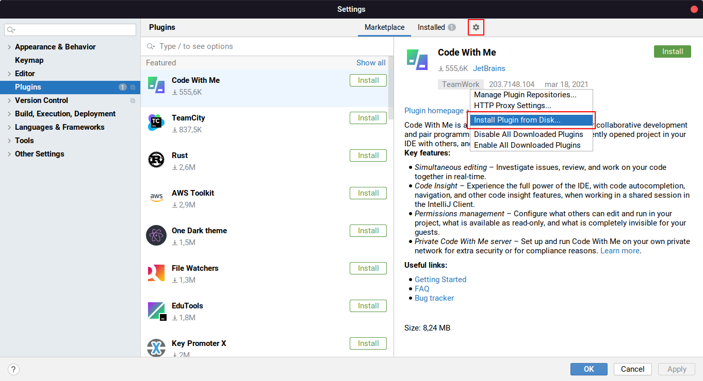
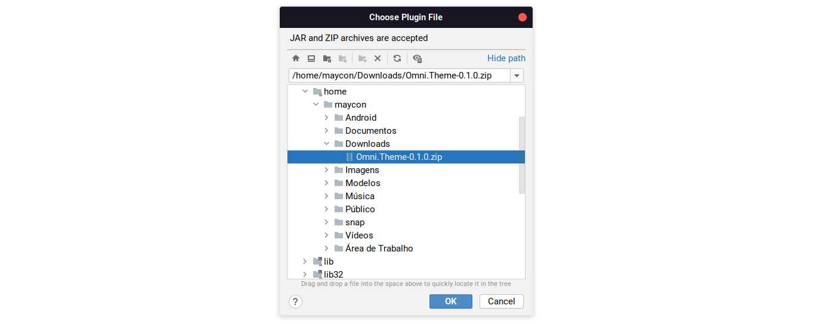
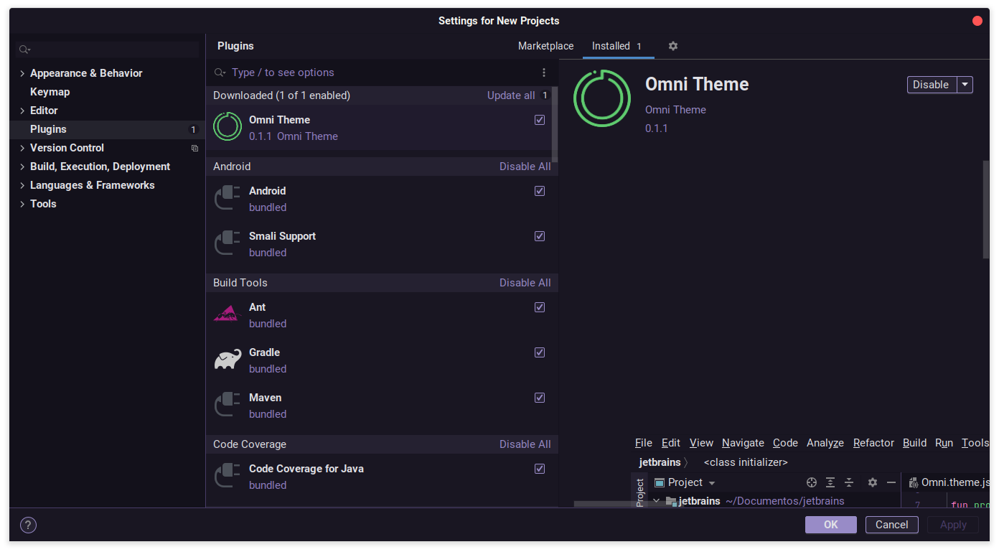

### [JetBrains](https://www.jetbrains.com)

#### Install manually

Download [Omni.Theme-0.1.0.zip](https://github.com/Mayconsgs/jetbrains/releases/download/v0.1.0-beta/Omni.Theme-0.1.0.zip)
.

#### Activating theme

1. Open your IntelliJ IDEA or based IDE in IntelliJ
2. Go to **Settings** > **Plugins**
3. On the plugins screen, go to install manually
   

4. Chose yor .zip download file.
   
   
5. Apply Theme.
   
